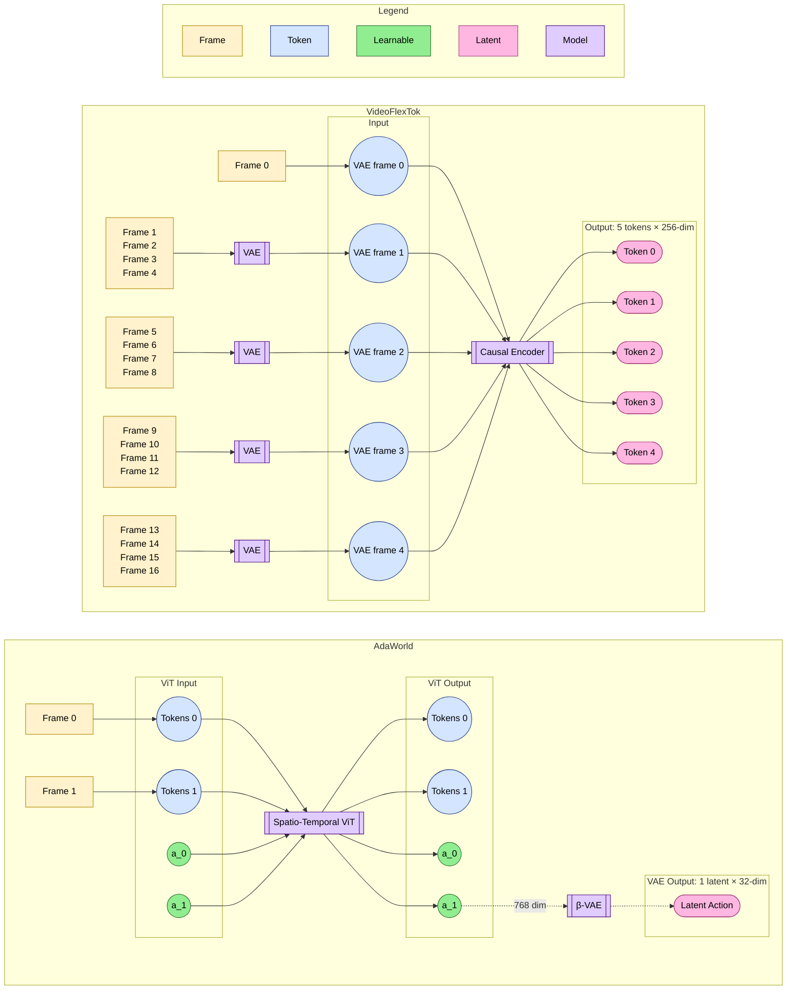

## AdaWorld
 ### Video Data Generation
We take an action with a random agent for 4 frames but only capture the last i.e. we skip the first 3. Now we have Frame 0 and Action 0. This is repeated with a new action, and so on, until the agent dies or the maximum number of steps is reached.
### Latent Action Generation
*Alessio verify*. We take two consecutive frames and feed them to the model. The model also appends two learnable action tokens (for each of the tokens) to the input. We take only the second action token from the output. This is fed to the VAE and reduced from 768 to 32 dimensions.
## VideoFlexTok
 ### Video Data Generation
We take a no-op action for 4 frames and record all. Then, we take an action (one out 5) from a random agent for 4 frames and record all. This makes 8 total frames, first 4 'without' an action and the second 4 with an action. This is repeated until the agent dies or the maximum number of steps is reached.
### Latent Action Generation
We take frames *t* to *t+15* and duplicate the first frame to have 17 frames. We feed this to the model and take tokens 1 and 2 from the output. Tokens 3 and 4 are causally dependent on the previous ones and we ignore them for now. Token 0 is not used right now but we should double check this. *Stipe verify*. These two tokens each have 256 dimensions with the intuition that they're ordered by importance (similar to PCA).

## Differences
- The videos are sampled differently!
- VideoFlexTok does not have action tokens directly; we currently take a no-action-frame and an action-frame token pair. Maybe the action-frame token alone is enough but we have to see.
- The losses between the two methods are different. AdaWorld learns latent actions by encoding and decoding frames based on them i.e. with a reconstruction loss directly influenced by actions. VideoFlexTok learns tokens that autoregressively deconstruct a video from the beginning, without the concept of actions.

